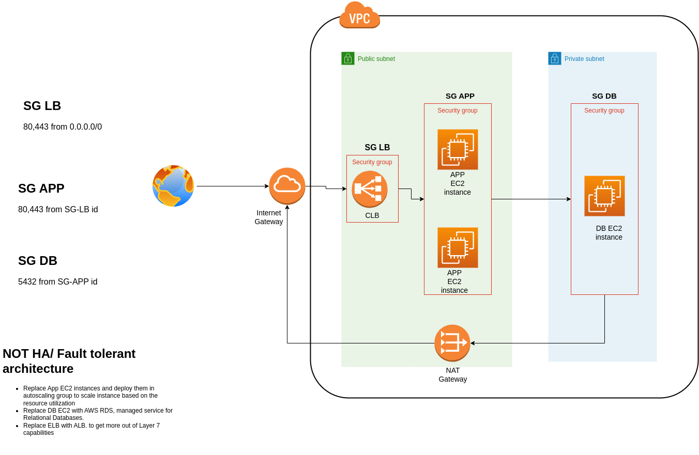

# Foo App

## Architecture



## Pre-Requisite

- AWS CLI
- Terraform
- Node
- Docker

Follow the next steps in its order.

### Setup the AWS CLI

Please, make sure to have the CLI installed

`aws configure` or use environment variables

### Create an S3 bucket for bootstrap

Exchange the `BUCKET_NAME` and if necessary the `AWS_REGION` in the `Makefile` and run

```sh
make bucket
```

Go to the `infrastructure/instances/user_data.tpl` and exchange in line 11 the `aws-terraform-jolo` with your bucket which you defined above in `BUCKET_NAME`.

### Upload the app to the S3- Bucket

The following command zip the app and uploads that to the S3- Bucket

```sh
make upload_app
```

If you don't want to work with Github yet, you can jump to [Deployment](#deployment)- Section.

### Create a role on the AWS Account for Github to deploy

You need to use OpenID connect on AWS for letting Github assume a role.
Please, read [the documenation](https://docs.github.com/en/actions/deployment/security-hardening-your-deployments/configuring-openid-connect-in-amazon-web-services) and save the role in a Github Secret `secrets.aws_role_arn`.

To create via CLI (not recommended):

```sh
make openid_connect
```

## Folder Structure

```sh
.
├── app
│   ├── db
│   └── node_modules
└── infrastructure
    └── modules
        ├── database
        ├── instances
        └── networking
```

## Deployment

After the [Pre-requisite](#pre-requisite), it should get deployed via GitHub actions.
If not run `make tf_apply` locally.
